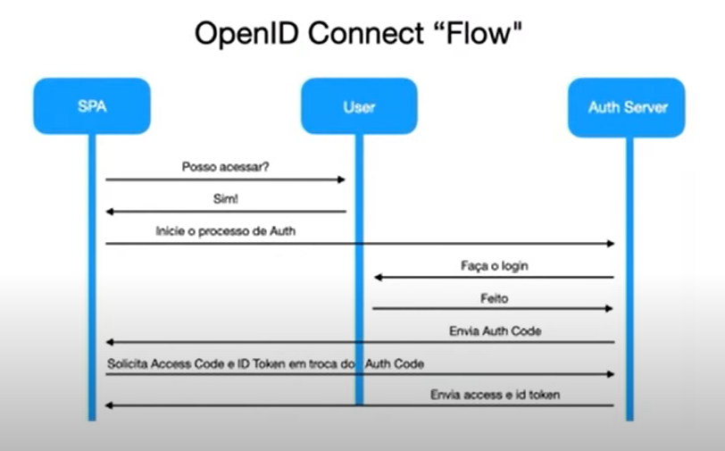

# OAUTH2 E OPENID CONECCT COM KEYCLOAK
- [x] - Anotações
- [ ] - [olhar as anotações sobre <b>MÓDULOS</b> na pasta modulos](https://github.com/RogerioPST/aprendendo-angular/blob/master/meu-primeiro-projeto/modulos/README.MD)
- [ ] - [olhar as anotações sobre <b>ng-content</b> para passar componentes para outros componentes](https://github.com/RogerioPST/aprendendo-angular/blob/master/exemplo-diretivas/ng-content/README.MD)

## Analogia: Delegação de responsabilidade/ Autorização temporária a um recurso de terceiro (OAUTH 2):

### Exemplo de analogia: Wesley é dono de uma conta bancária. Mariana é esposa de Wesley. Davi é gerente da conta bancária do Wesley e a Sara que trabalha em um cartório.

### Em um belo dia, Wesley pede para a sua esposa fazer uma transferência da sua conta para uma construtora. Ao chegar no banco, Mariana pede ao gerente Davi para realizar a operação. Naquele momento, Davi percebe que a conta está apenas no nome do Wesley e que ela não tem a autorização para realizar essa transferência e recomenda que Mariana vá ao cartório pegar uma procuração para realizar essa transferência em nome do Wesley e é o que ela faz.

### Com a procuração em mãos, Mariana vai novamente ao banco tentar realizar a transferência, entrega a procuração para o gerente.

### Para garantir que a procuração de fato é válida, o gerente verifica no sistema do cartório se aquela procuração tem validade.

### O gerente Davi confirma a validade da procuração e faz uma observação para Mariana: "essa procuração é válida apenas por um mês. Fique atenta a essa data, pois após essa data, você terá que buscar uma nova procuração"

### OAUTH 2 é um framework de autorização que permite que aplicações terceiras possam ter acesso limitado a um serviço HTTP.

### Relacionando a história ao fluxo de autorização do AUTH 2, , temos que Wesley é Resource Owner (dono do recurso), Mariana seria o client (aquele que quer autorização para acessar aquele recurso), Davi é o Resource Server (local onde os dados daquele recurso estão armazenados) e o cartório que nesse caso é o Autorization Server

### Como podemos aproveitar todo esse fluxo para também podermos realizar um processo de autenticação? R: Protocolo Open Id Connect / Saml - camada que fica no topo do OAUTH 2 que permite que os clientes possam verificar a identidade de um usuário final através do processo de aunteticação por um servidor de autorização.

### Vamos imaginar que temos uma SPA que desejamos realizar o processo de login. Nesse caso, qdo vamos iniciar o processo a SPA ela faz uma chamada para o servidor de autenticação e esse servidor automaticamente redireciona o usuário para uma tela de login. Ao realizar o login e ser validado pelo servidor, o servidor enviará um código para a SPA um código de autorização. Com esse código em mãos, a SPA enviará de volta para o servidor de autenticação solicitando a troca desse código por um ACCESS TOKEN e também um ID TOKEN (que tem as informações básicas do usuário). Com esses tokens, a SPA poderá trabalhar de forma totalmente autenticada. Esse ID TOKEN é um JWT TOKEN (JSON WEB TOKEN que nos permite informar com segurança os dados do usuário de forma assinada pelo servidor de autenticação para evitar qualquer tipo de fraude).

### KEYCLOAK é um servidor de autenticação e de autorização. Trabalha com tenants, como se fosse multi tenancy, como se ele conseguisse isolar diversos namespaces para usuários, para aplicações que vão fazer o processo de autenticação. Esses namespaces, tenants são chamados de realm. O realm Master foi criado especificamente para autenticar o próprio KEYCLOAK. Toda vez devemos criar um novo realm (por ex, demonstracao). Toda vez que for fazer um processo de autenticação no KEYCLOAK, teremos um CLIENT (a aplicação que vai fazer o login no KEYCLOAK).

### Ao adicionar o Client, temos que colocar: o Client ID (exemplo: app), Client Protocol (OpenId/Raml) e o root URL (qual a URL que vamos utilizar na aplicação que vai fazer o login utilizando o KEYCLOAK). Pq? Quando formos fazer o login no KEYCLOAK, ele vai redirecionar esse login para sua aplicação de volta, que é a root URL (localhost:8081, por ex).

### Quando é criado o Client, tem diversas configurações. Entre elas, o Access Type, que pode ser public, confidential (que vai necessitar de um SECRET (que o proprio KEYCLOAK pode gerar) para aquele Client para realizar o processo de login) e BEARER ONLY (que vai gerar o TOKEN para conseguir realizar o login). Também tem a configuração para não ter nenhum problema com CORS (ao tentar realizar uma chamada AJAX direto para o KEYCLOAK)

### Cadastra também no KEYCLOAK todos os usuários, por ex, Wesley c senha 123456, o provider como 'localhost:8080/auth/realms/demonstracao'

### Envio um aurotization code e pego o acesstoken. O type para autorização, por ex, é 'Bearer' no accesstoken e para autenticação é 'ID' rawidToken. o refresh token é p buscar um token novo caso tenha expirado.

